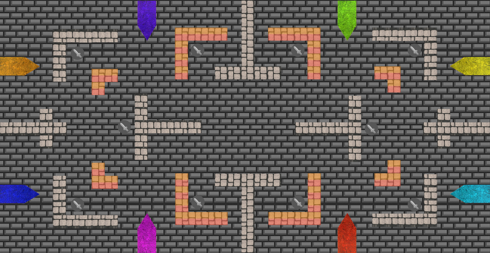

# Projeto Knight Squad
## FPRO/MIEIC, 2020/21
## Vasco Rafael Maia Ribeiro Guedes (up202004395)
## 1MIEIC0X

### Objetivo

Jogo baseado no jogo [Knight Squad](https://store.steampowered.com/app/294000/Knight_Squad/), em PyGame.

### Descrição

É um jogo de "battle royale". Podem jogar entre 1 e 3 jogadores no mesmo computador acompanhados por 3 a 5 "bots".

No mapa é possível encontrar poderes que aparecem no mapa aleatoriamente sendo que deixam de estar ativos quando é utilizado por algum dos jogadores.

Também existem diversas armas (espada e broca). A espada permite atacar a curta distância e a broca permite destruir algumas paredes quando ativa.

Um jogador mata o outro quando a sua arma colide com outro jogador. Ganha o último vivo.

### UI

### Pacotes

- Pygame, math, copy, random

### Tarefas

1. [ ] colocar os jogadores no local de partida
1. [ ] ler teclas, mover os jogadores
1. [ ] colisões entre jogadores
1. [ ] desenhar obstáculos e colisões entre jogadores e obstáculos
1. [ ] verificar qual foi o jogador vencedor
