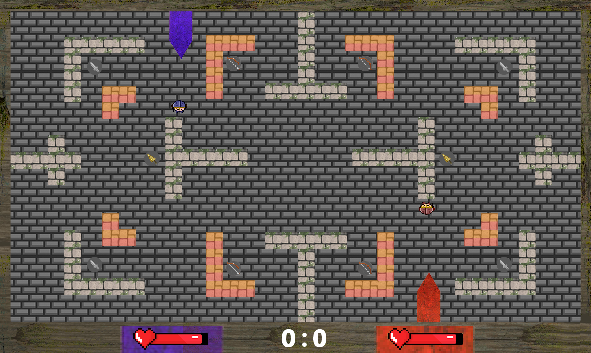

# Projeto Knight Squad
## FPRO/MIEIC, 2020/21
## Vasco Rafael Maia Ribeiro Guedes (up202004395)
## 1MIEIC0X

### Objetivo

Jogo baseado no jogo [Knight Squad](https://store.steampowered.com/app/294000/Knight_Squad/), em PyGame.

### Descrição

É um jogo de "battle royale". Desenvolvido para 2 jogadores no mesmo computador.

Existem diversas armas (espada, arco e broca). A espada permite atacar a curta distância (e a média distância quando-se ataca), a broca permite destruir algumas paredes quando ativada e o arco que dispara quando ativado. Tanto a espada como o arco podem ser evoluídos (3 níveis possíveis) sendo que com cada evolução a arma fica mais forte (tira mais vida) e no caso do arco permite que se dispare mais flechas de cada vez.

No mapa é possível encontrar poderes que aparecem no mapa aleatoriamente sendo que desaparecem quando um utilizador os recolhe.
Poderes:
  vida extra (coração): recupera vida
  varinha: permite atravessar paredes sem as destruir (durante um período de tempo)
  poção: fica invensível (durante um período de tempo)
  escudo: fica com o escudo até ser atacado e quando é atacado não perde vida
  
Um jogador mata o outro jogador quando a vida do segundo fica a zero. Ganha o que ganhar mais partidas (de três)

### UI

### Pacotes

- Pygame, math, copy, random, pygame.locals

### Tarefas

Finalizado
